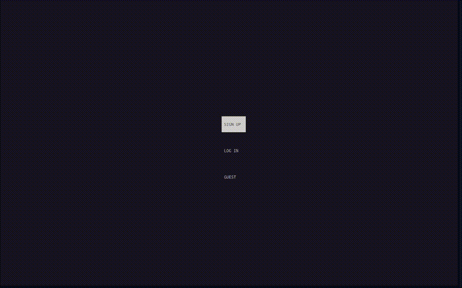

# Terminal Roguelike

A terminal-based roguelike game developed in C as a **Fundamentals of Programming** course project at **Sharif University of Technology (2024)**.



## Features

* Procedurally generated rooms and multiple levels
* Turn-based combat and different enemy types
* Weapons, food, and spells
* Fog of war and map exploration
* Player login/signup and scoreboard
* Difficulty and visual settings
* Background music and sound effects

## Technologies

* **C**
* **ncurses** — terminal UI
* **SDL2 / SDL2_mixer** — audio

## Build

Install the required dependencies and compile with:

```bash
gcc main.c -o roguelike -lncurses -lSDL2 -lSDL2_mixer
```

Then run:

```bash
./roguelike
```

## Project

This project was developed for the 2024 Fundamentals of Programming course at Sharif University of Technology.
